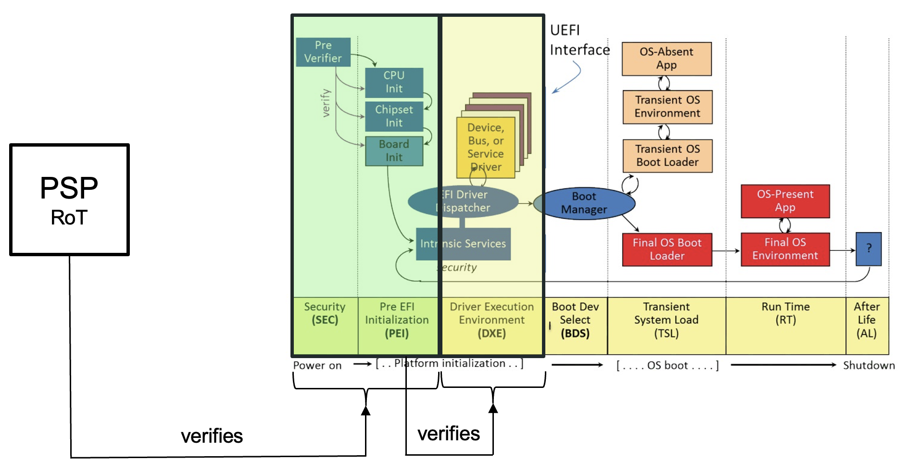

# AMD

## AMD SecureBoot

AMD Secure Boot is designed to ensure that a system boots using only software trusted by the Original Equipment Manufacturer (OEM). It establishes a chain of trust starting from the hardware, preventing unauthorized code from being executed during the boot process. This chain of trust is anchored in the AMD Secure Processor (ASP) or also called Platform Security Processor (PSP), a dedicated security subsystem within AMD processors.

### Bootflow

The host firmware boot process normally consists out of multiple phases. Generally speaking the first code that is executed in host firmware is called the Initial Boot Block (IBB). The IBB is responsible for setting up some of the hardware ,especially security-critical hardware like the Trusted Platform Module (TPM). In the UEFI ecosystem the first phases to boot up are the SEC and PEI phase. For more information about the UEFI phases follow the link [here](https://github.com/tianocore/tianocore.github.io/wiki/PI-Boot-Flow). in the coreboot ecoysstem the first phases to boot up are the [bootblock and verstage](https://doc.coreboot.org).

When AMD Secure Boot is active, the AMD Secure Processor verifies the IBB and checks that it has not been tampered with. After successful verification, it executes the IBB and then the IBB is responsible to carry the trust chain onwards with vendor-specific methods e.g. UEFI Secure Boot or coreboot's measured boot. The following image is take from [IOActive Labs](https://labs.ioactive.com/2024/02/exploring-amd-platform-secure-boot.html).

### Platform Security Processor Structures

The PSP is a critical component of AMD’s security architecture. It acts as the root of trust for the entire system and is responsible for initializing the Secure Boot process. The PSP include:

1. Immutable ROM Code: This is the initial code executed by the PSP. It cannot be modified and contains the root of trust logic.
2. PSP Firmware: Loaded after the ROM code, the PSP firmware performs additional security checks and initialization tasks.
3. PSB Status Register (Offset 0x10998): This register provides information about the status of the Platform Secure Boot (PSB). A value of 0x00 indicates no errors, while a non-zero value indicates specific error codes​.

### Key Hierarchy

The key hierarchy in AMD Secure Boot involves several layers, ensuring that each stage of the boot process is verified before proceeding:

1. Root Key

This is the highest level key, embedded in the hardware, which is used to verify the initial PSP firmware.

2. Firmware Keys

- *PSP Firmware Key*: Used to sign the PSP firmware, ensuring its authenticity and integrity.
- *BIOS/UEFI Firmware Key*: The BIOS/UEFI firmware is signed using a private key corresponding to the ASP's public key. This key is verified during the Secure Boot process.

### Verification Process

The Secure Boot process involves multiple steps to verify the authenticity and integrity of the boot components:

- Loading PSP ROM code
- Loading PSP Code
- Verification of the BIOS Image? (or only IBB)

## AMD MemoryGuard

AMD MemoryGuard provides full memory encryption capabilities to help protect data stored in DRAM from physical attacks, such as cold boot attacks. This technology encrypts system memory transparently, using a dedicated hardware encryption engine within the processor itself. This encryption occurs with minimal performance impact and without requiring changes to the software running on the system. MemoryGuard is particularly valuable in environments where sensitive data must be protected from unauthorized physical access.

## AMD SEV

AMD Secure Encrypted Virtualization (SEV) enhances the security of virtual machines by encrypting the memory of each VM with a unique encryption key. SEV is built into the processor and managed through the hypervisor, providing isolation between virtual machines and the hypervisor itself. This technology helps prevent unauthorized access and tampering by restricting the ability of the hypervisor to access encrypted virtual machine memory, ensuring that sensitive data remains protected even in a compromised system.

## AMD SEV SNP

AMD SEV-SNP builds upon the SEV technology by adding strong memory integrity protection capabilities. SEV-SNP extends the memory encryption provided by SEV to include measures that prevent malicious modification of memory, such as replay or remapping attacks. This is achieved by using a hardware-based approach to validate the integrity and the proper allocation of memory pages when they are accessed. SEV-SNP ensures that the system remains secure even if the hypervisor is compromised, providing an additional layer of security for virtualized environments.

# Prelimitary Testplan

## AMD Platofrm Secure Boot

- Get PSP MMIO Base Address from:
    - 0x13E102E0 for families 17h, model 30h/70h or family 19h, model 20h or
    - 0x13B102E0 for all other models
- Read `FUSE_PLATFORM_SECURE_BOOT_EN` from `PSB_STATUS` by reading PSP MMIO Base Address + `0x10994` (https://github.com/mkopec/psb_status suggests Base Address is 0x3800000)
- Check 'FUSE_PLATFORM_SECURE_BOOT_EN' (Bit 24) of `PSB_STATUS` - If '1' == PSB fused silicon (https://github.com/mkopec/psb_status)
- Other interesting bits:
    - Bit 0:7 `Platform Vendor ID`
    - Bit 8:11 `Platform Model ID`
    - Bit 12:15 `BIOS Key Revision`
    - Bit 16:19 `Root Key Select` (?)
    - Bit 25 `Anti-Rollback` (?)
    - Bit 26 `Disable AMD Key` (AMD disable key to prevent booting a BIOS signed with the AMD root signing key)
    - Bit 27 `Disable Secure Debug`
    - Bit 28 `Customer Key Lock` (The customer key lock to permanently burn the fuses)
- Check PSB Status Register at `0x10998`
    - Bit 0:7 `PSB Status` is _zero_ if **no** error occured, non-zero otherwise.

Tests:
- Check if PSB is enabled (`PSB_Status` is enabled)
- Check if PSB has been fused (`Customer Key Lock` is enabled)
- Check if `Disabled AMD Key` is set to disabled booting AMD signed images
- Check if `Disbale Secure Debug` is enabled (disabled)
- Check if `PSP Status` is non-zero
- Check if `Platform Vendor ID`, `Platform Model ID`, `BIOS Key Revision` is non-zero.

## AMD MemoryGuard

- Check: 0x8000001f[eax]:
    - Bit[0] indicates support for SME
    - Bit[1] indicates support for SEV

if SME support:
- Read `MSR_AMD64_SYSCFG` (`0xc00100010`) to determine if SME is enabled.
    - Bit[23]
        - 0 = memory encryption features are disabled
        - 1 = memory encryption features are enabled

if SEV support:
- Read `MSR_AMD64_SEV` (`0xc0010131`) to determine if SVE is enabled.
    - Bit[0]
        - 0 = memory encryption is not active
        - 1 = memory encryption is active

Note: If SME is enabled and SEV is supported but not enabled, Linux can enable Memory
Encryption if `CONFIG_AMD_MEM_ENCRYPT_ACTIVE_BY_DEFAULT=y` or adding `mem_encrypt=on`
to the kernel commandline.

## AMD SEV

- Read MSR `SEV_STATUS` (`C001_0131`) (This MSR indicates which SEV features were
enabled in the last VMRUN for that guest as shown in Table 15-34.)
- Read MSR `SPEC_CTRL`
    - ?

## AMD SEV-SNP

More information: https://www.amd.com/content/dam/amd/en/documents/epyc-technical-docs/specifications/56860.pdf

- Read `MDATA` and `TCB_VERSION` in order to gain more information about SEV-SNP firmware used.
- 
